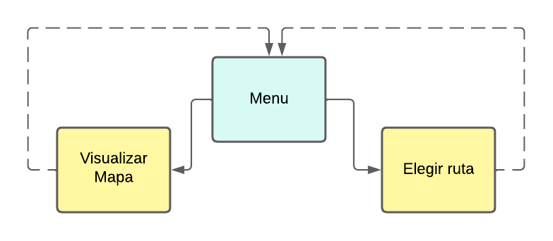

# Routing | PoT sobre realidad aumentada proyectada

## Objetivo:
 Aplicacion de realidad aumentada con geolocalizacion, la cual ayude al usuario a trasladarse de un edificio del campus a otro, que lo pueda hacer de la forma tradicional en que las aplicaciones te dan instrucciones (una ruta trazada en el mapa), y que aparte me pueda ayudar de la camara de mi dispositivo, para que la aplicacion detecte un trigger como punto de inicio y de ahi me vaya pintando en la imagen las flechas de hacia donde moverme 

## Arquitectura (diagrama)

##  archivos (C#)

### Assets

## Como funciona (mapa de navegación)

## Historia de usuario
- El usuario inicia la aplicación
- El mapa es desplegado y su posicion dentro de el 
- El usuario intereactua con el mapa
- El usuario elige un destino y se muestra la ruta 